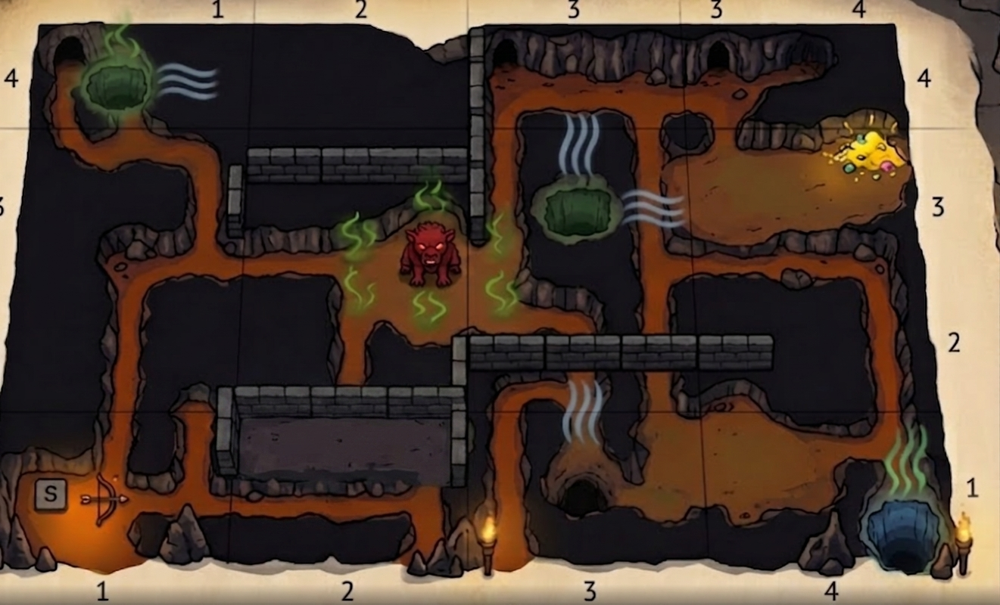
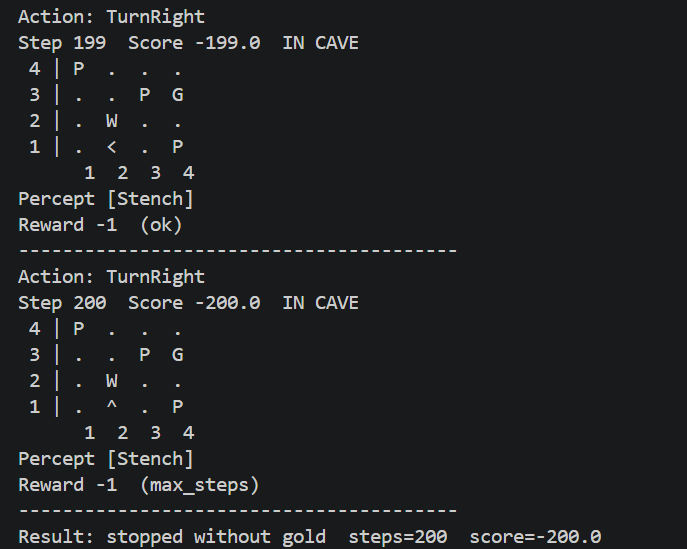
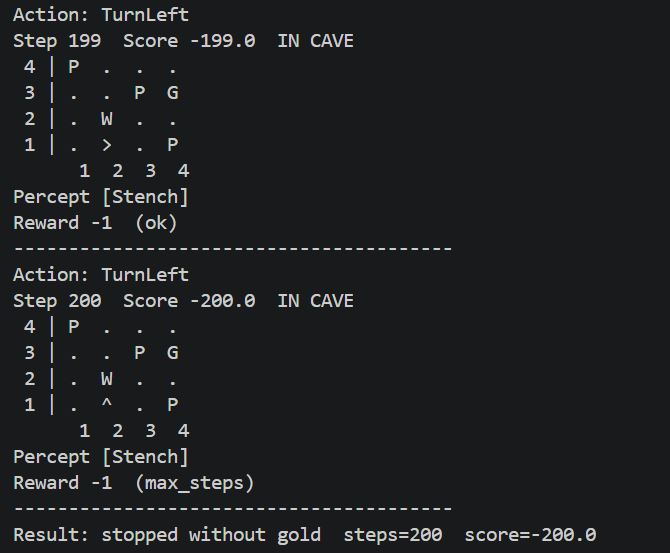
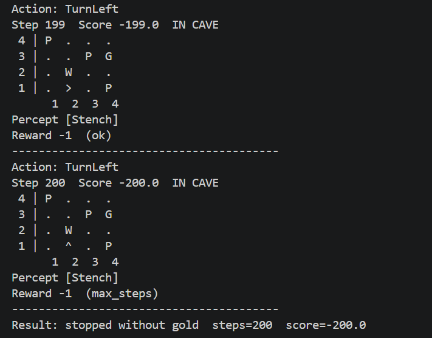
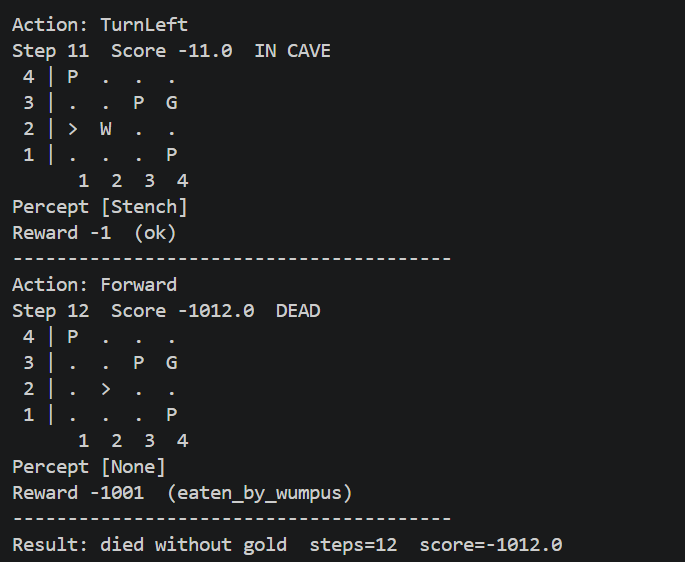

# Ejercicio 1 — Cambiar la ubicación del Wumpus y los pits

## Objetivo

Crear una nueva configuración modificando la posición del **Wumpus** y de los
**pits**, respetando las reglas del entorno, y analizar el efecto sobre los
distintos agentes.

### Diagrama de cueva

### Resultados de agentes

| Simple reflex | Model based |
| :---: | :---: |
|  |  |
| Goal based| Utility based |
|  |  |

### Reporte
Primeramente, de forma personal, el objetivo en el diseño del mapa fue brindar alternativas al agente de caminos libres y probarlo en el posible regreso por una vía distinta que se mantuviera segura más allá de la memoria de ruta.\
Al poner a prueba a cada uno de los agentes, se identifica que ninguno logra escapar de la cueva con el oro, incluso a pesar del nivel de deducción que tenían algunos agentes más desarrollados. Los primeros 3 agotan el número de pasos atrapados sin mucha libertad para realizar un traslado contínuo y el número 4 termina siendo deborado tras realizar tan sólo 12 pasos. En el análisis de los recorridos se identifica que al menos para los primeros tres casos no se logra tener una deducción buena del camino y en el cuarto caso, intenta probar una alternativa diferente al camino usual, pero termina cayendo en un estancamiento. \
La hipótesis principal del comportamiento reflejado en los agentes para estas pruebas es que al ampliar el grado de libertad en el camino, el agente no logra tener tantos sensores a su favor. Es decir, al tener tan alejados los pits, no logran deducir la acción más adecuada. Es decir, que hasta cierto punto se carece de información para actuar, a pesar de que en el diseño se logran identificar caminos libres completamente, el agente sólo tiene un ambiente parcialmente observable, para el cuál requiere información de los elementos del mapa para poder guiarse, para poder sensar y actuar. Por lo que, lo imposibilita poder conseguir un resultado favorable.\
Termina siendo necesario poder considerar a los elementos del mapa como una guía en la obtención del resultado.