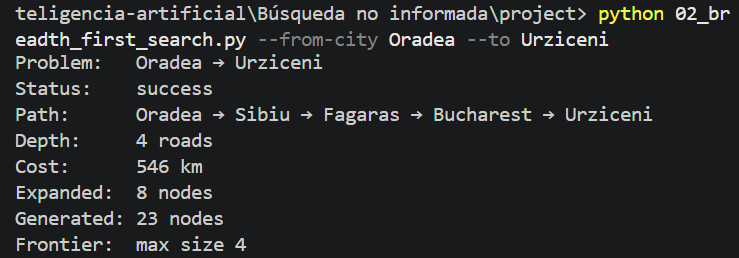
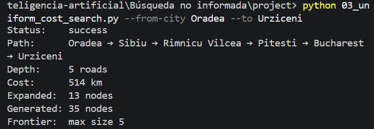
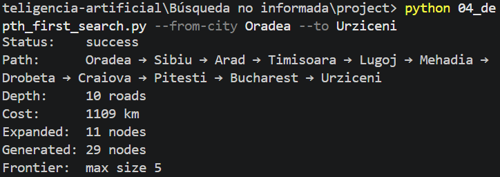
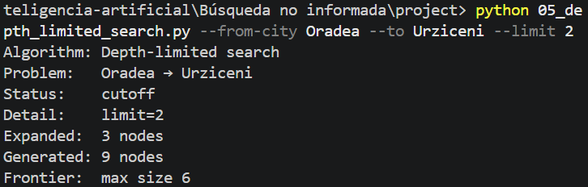
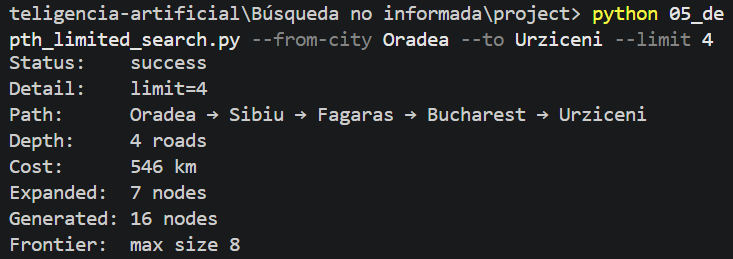
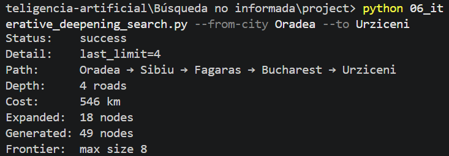

# Ejercicio 1 — Comparar BFS, UCS, DFS, DLS e IDS en el mapa de Rumania

## Objetivo

Elegir una ruta distinta de Arad → Bucharest, correr BFS, UCS, DFS, DLS e IDS,
y analizar diferencias de camino, costo, profundidad y nodos expandidos.

### Diagrama de nueva ruta

### Resultados de algoritmos de busqueda

| BFS | UCS |
| :---: | :---: |
|  |  |
| DFS| DLS|
|  |  |
| DLS| IDS|
|  |  |

