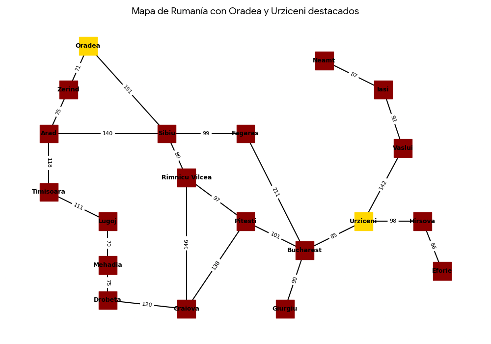
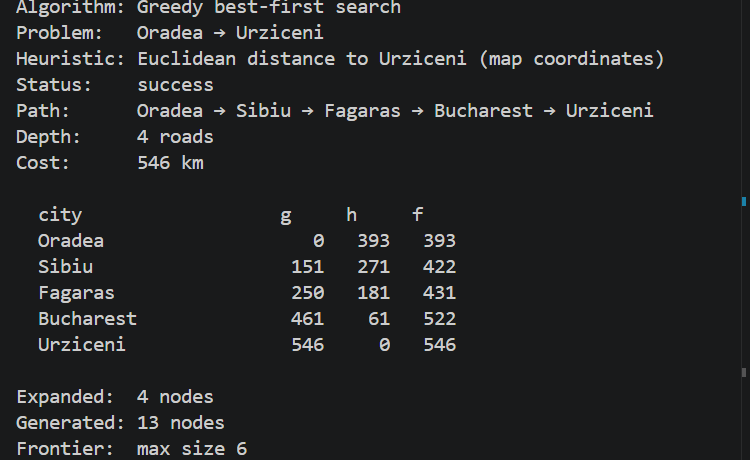
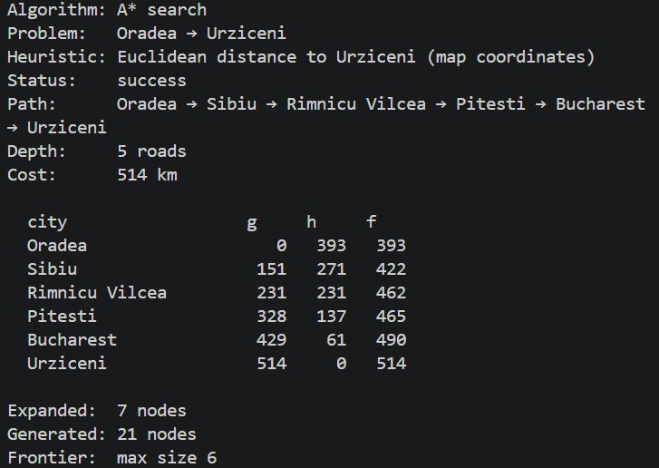

# Ejercicio 1 — Comparar Greedy y A* en el mapa de Rumania

## Contexto

En el proyecto `Búsqueda informada/project` (AIMA cap. 3–4, Figuras 3.2 y 3.22)
se resuelve el problema de **encontrar una ruta** entre dos ciudades del mapa
carretero de Rumania. Dos algoritmos de búsqueda **informada** comparten el
mismo grafo, el mismo `RouteFindingProblem` y la misma heurística `h(n)`:

## Objetivo

Elegir una ruta distinta de Arad → Bucharest, inspeccionar `h(n)`, correr
Greedy y A*, y analizar diferencias de camino, costo, profundidad y nodos
expandidos a la luz de `g`, `h` y `f`.

### Diagrama de nueva ruta

### Resultados de algoritmos de busqueda

| GBF | A* |
| :---: | :---: |
|  |  |