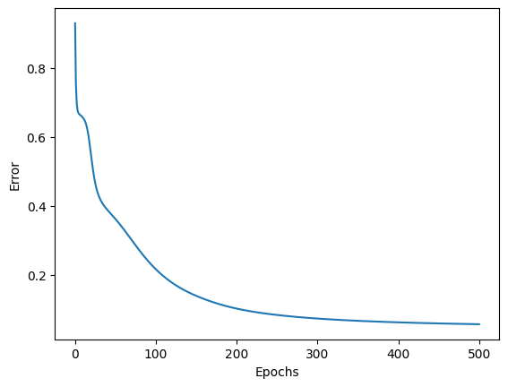
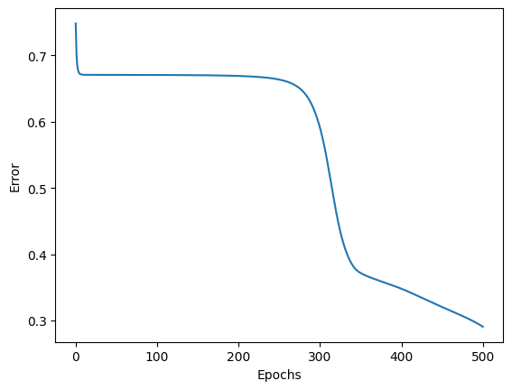
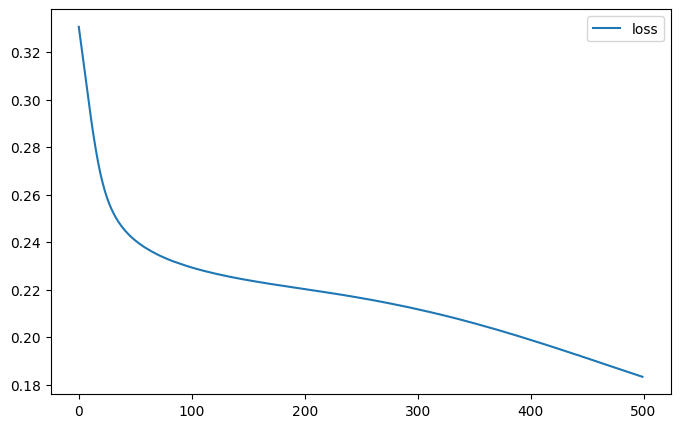
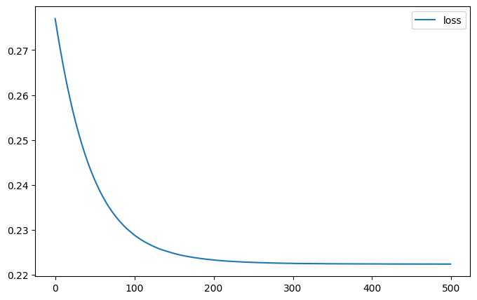

# Ejercicio 1 — Más capas en el perceptrón multicapa (Iris)

## Objetivo

Correr ambas notebooks en **Google Colab** con la arquitectura original,
**agregar dos capas** a cada red, volver a entrenar y **comparar** qué cambia
(curva de error/pérdida, velocidad, calidad de la clasificación).

### Resultados Gráficas Loss

| Multilayer Perceptron Original | Multilayer Perceptron Editado |
| :---: | :---: |
|  |  |
| Keras Multilayer Original | Keras Multilayer Editado|
|  |  |
