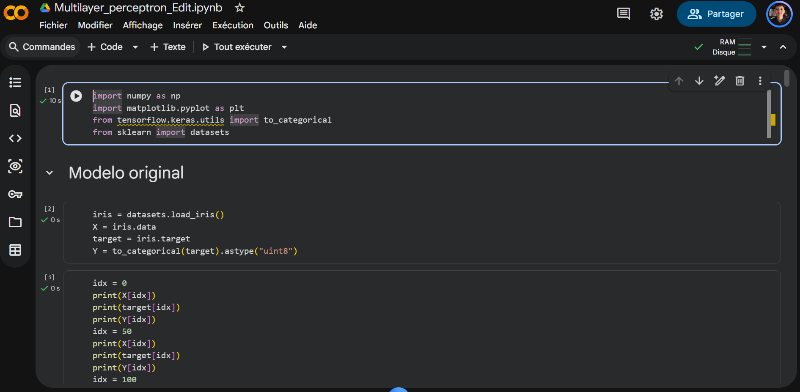
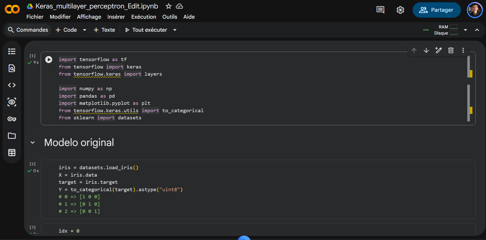

# Ejercicio 1 — Más capas en el perceptrón multicapa (Iris)

## Objetivo

Correr ambas notebooks en **Google Colab** con la arquitectura original,
**agregar dos capas** a cada red, volver a entrenar y **comparar** qué cambia
(curva de error/pérdida, velocidad, calidad de la clasificación).

### Resultados Gráficas Loss

| Multilayer Perceptron Original | Multilayer Perceptron Editado |
| :---: | :---: |
|  |  |
| Keras Multilayer Original | Keras Multilayer Editado|
|  |  |

### Evidencias Colab

| Multilayer Perceptron Colab | Keras Multilayer Colab |
| :---: | :---: |
|  |  |

### Reporte de prueba

Después de haber corrido ambos códigos con las modificaciones solicitadas, se puede identificar a través de las gráficas de pérdida de error, el incremento de las 2 capas ocultas no ofrecen realmente una mejora en el modelo.\
Para el caso del Perceptron Multicapa de Numpy, al agregar las capas a la red, el error parece "estancarse" previo al $epoch= 300$, hasta que empieza a descender, primero de manera abrupta y luego de una forma más gradual y constante. Al profundizar la red, los gradientes que retropropagas hacia las primeras capas se vuelven infinitamente pequeños y la red de alguna manera "lucha" durante casi 250 épocas solo para encontrar una dirección de descenso válida. En comparación, el modelo original converge fluidamente a un error $<0.1$, el modelo editado incluso termina convergiendo a un error más alto, aproximadamente 0.30.

El modelo ejecutado con Keras muestra diferencias menos drásticas entre sí, específicamente, con la agregación de las capas ocultas, la gráfica de pérdida muestra una reducción del error que al principio desciende de una forma más rápida previo a $epoch= 100$, pero a partir de  $epoch= 200$ parece aplanarse y no logra reducirse más, se queda por arriba de 0.2.\
Se atribuye una convergencia en un mínimo local o capacidad bloqueada por tasa de aprendizaje. Al agregar más parámetros, la superficie de pérdida se vuelve mucho más compleja. Con la misma tasa de aprendizaje (learning rate), el modelo quedó atrapado prematuramente en un mínimo local.

Al agregar capacidad (capas) a una red neuronal incrementa la complejidad del espacio de búsqueda de parámetros. Sin ajustar las funciones de activación o la tasa de aprendizaje, se presentan dos fenómenos: Gradientes desvanecidos (retraso en el aprendizaje) y Convergencia Prematura en Mínimos Subóptimos.
