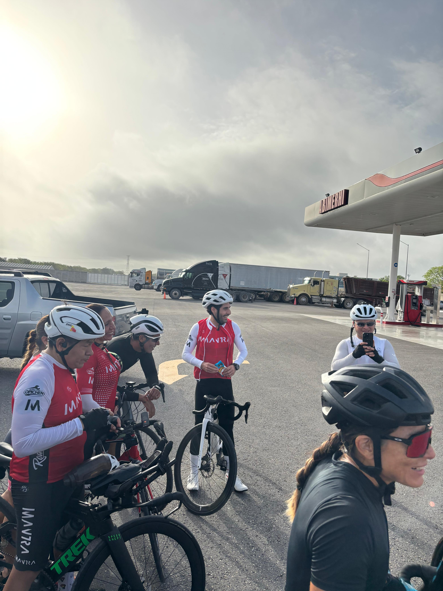
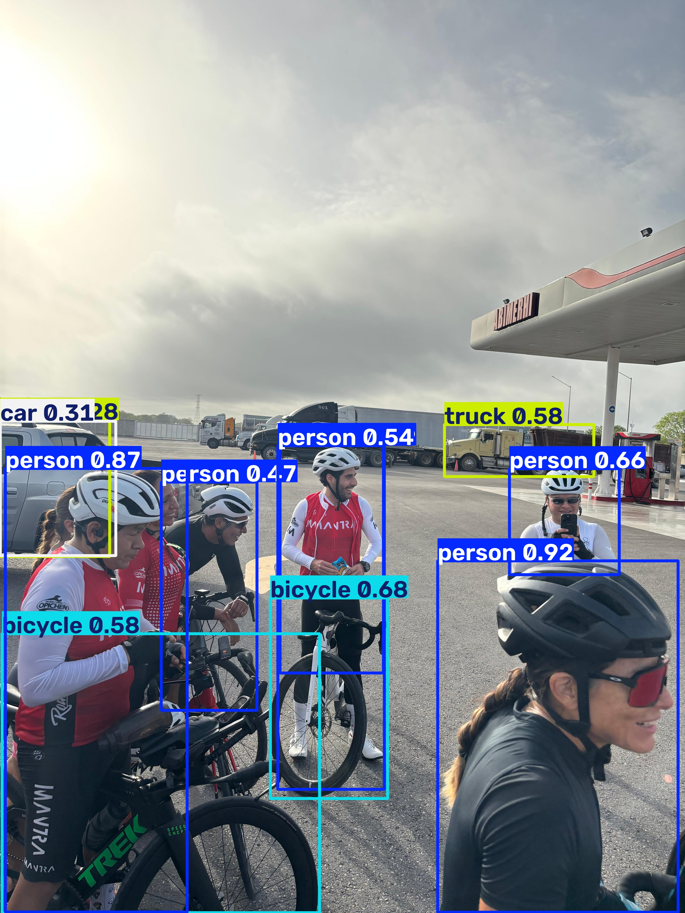

# Ejercicio 1 — Cambiar la imagen de predicción en YOLO

## Objetivo

Correr la notebook en Colab **tal como está**, sustituir las dos imágenes de
muestra por **una imagen tuya** (la misma en ambas predicciones) y comparar
qué objetos detecta YOLO en la foto original frente a la tuya.

### Resultados Análisis Imagenes

| Imagen Zidane Original | Imagen Zidane Analizada |
| :---: | :---: |
|  |  |
| Imagen Bus Original | Imagen Bus Analizada|
|  |  |
| Imagen Personal Original | Imagen Personal Analizada|
|  |  |

