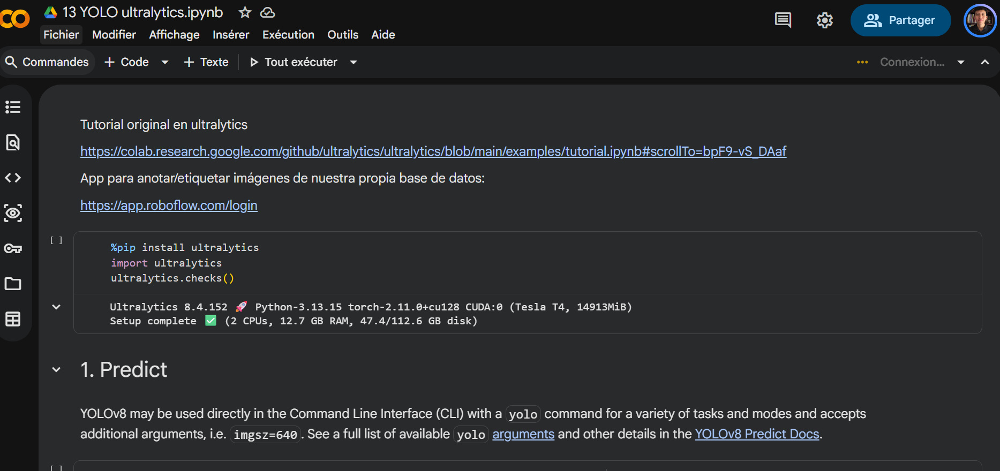

# Ejercicio 1 — Cambiar la imagen de predicción en YOLO

## Objetivo

Correr la notebook en Colab **tal como está**, sustituir las dos imágenes de
muestra por **una imagen tuya** (la misma en ambas predicciones) y comparar
qué objetos detecta YOLO en la foto original frente a la tuya.

### Resultados Análisis Imagenes

| Imagen Zidane Original | Imagen Zidane Analizada |
| :---: | :---: |
|  |  |
| Imagen Bus Original | Imagen Bus Analizada|
|  |  |
| Imagen Personal Original | Imagen Personal Analizada|
|  |  |

### Evidencia Colab

| Evidencia Colab |
| :---: |
|  |

### Reporte de prueba

Después de correr al algoritmo de YOLO en la imagen personal, se encuentran resultados destacados. Se resalta que la intención del uso de la imagen selecionada era poder poner a prueba al algoritmo con una variedad de objetos y personas, sumando la dificultad de que las personas tenían lentes o cascos para incrementar la dificultad.\
Se observa por los resultados que fueron identificadas 5 de 6 personas, 2 de 4 bicicletas visibles e incluso logró identificar de manera exitosa un camión y un auto en el fondo del paisaje.

Los objetos no identificados se atribuyen principalmente a la parcialidad con la que aparecen en la imagen y también con la lejanía a la que se aprecian, además de que algunos pueden no estar dentro de la base de datos que entrena al modelo. 