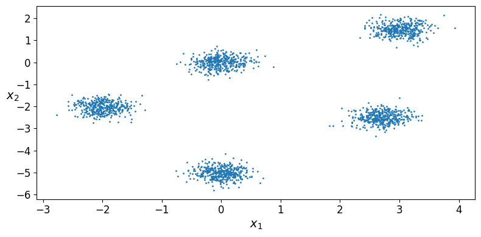
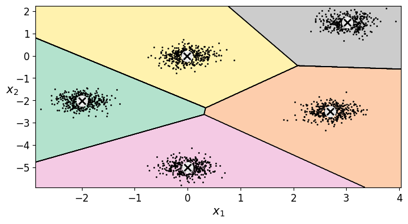
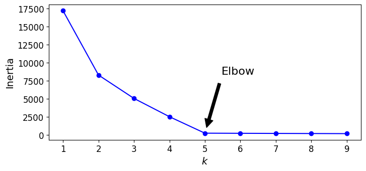
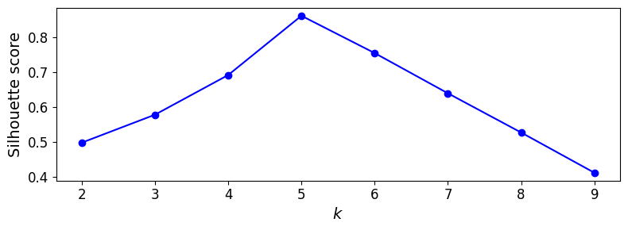

# Ejercicio 1 — Separar los blobs y volver a elegir \(k\)

## Objetivo

Correr la notebook en Colab **tal como está**, anotar el \(k\) que sugieren
codo y silueta, **separar los 5 blobs** en el arreglo `blob_centers` (y, si
hace falta, `blob_std`) y volver a graficar. Debes ver si el codo y la
silueta se mueven hacia **\(k = 5\)**.

### Resultados Análisis Imagenes
| Imagen Scattering Original | Imagen Scattering Modificado |
| :---: | :---: |
|  |  |
| Imagen Voronoi Original | Imagen Voronoi Modificado |
|  |  |
| Imagen Elbow Original | Imagen Elbow Modificado|
|  |  |
| Imagen Silhoutte Original | Imagen Silhoutte Modificado|
|  |  |

### Reporte de prueba

Antes de resaltar los resultados de la prueba, es importante mencionar que la intención en la configuración de los blobs para el scattering fue pensado para poder ejemplificar la dinámica del modelo a través de grupos bien segmentados y repartidos homogeneamente en el espacio; de manera que el modelo pudiera adaptarse bien con la implementación del clustering.

Al graficar los resultados con la Voronoi se identifican los clusters con los centroides bastante bien ubicados aglomerando la mayor parte de los conjuntos de la mejor manera, incluso mostrando la Voronoi con segmentaciones casi proporcionales. El método del codo con el método modificado muestra justo que esa separacióm homogenea entre los blobs permite al modelo asignar los clusters de la forma más ideal con $K=5$ porque cada uno está muy bien definido y no sería necesario asignar otro cluster adicional que hiciera la diferencia, por eso el codo, el punto de inflexión con la incercia, termina siendo con $K=5$. Mismo caso con el método de Silhoutte que termina siendo una doble comprobación, debido a las circunstancias ideales para las que se ejecuta el modelo, y que ejemplefican muy bien la teoría, tanto del clustering como de los métodos de optimización. 
