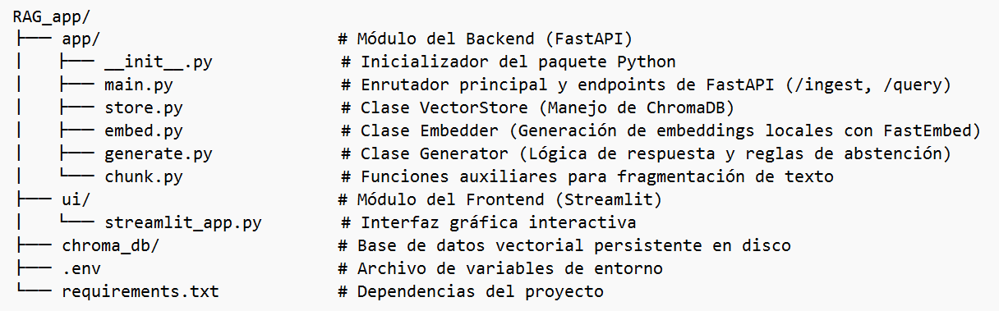
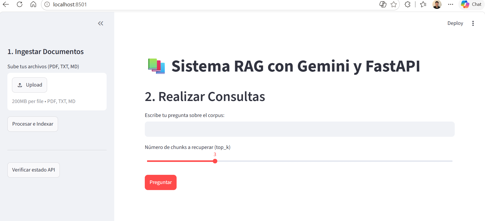
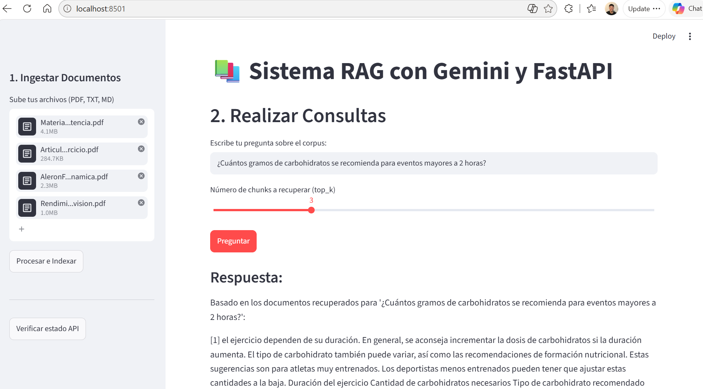
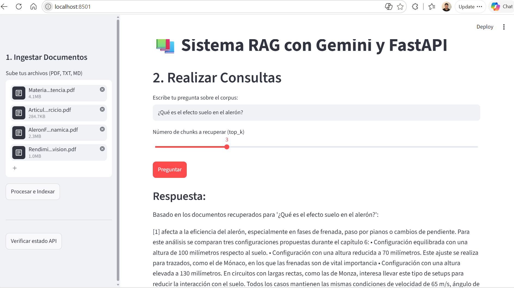
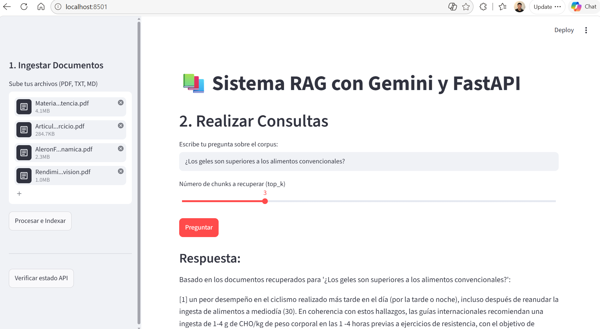
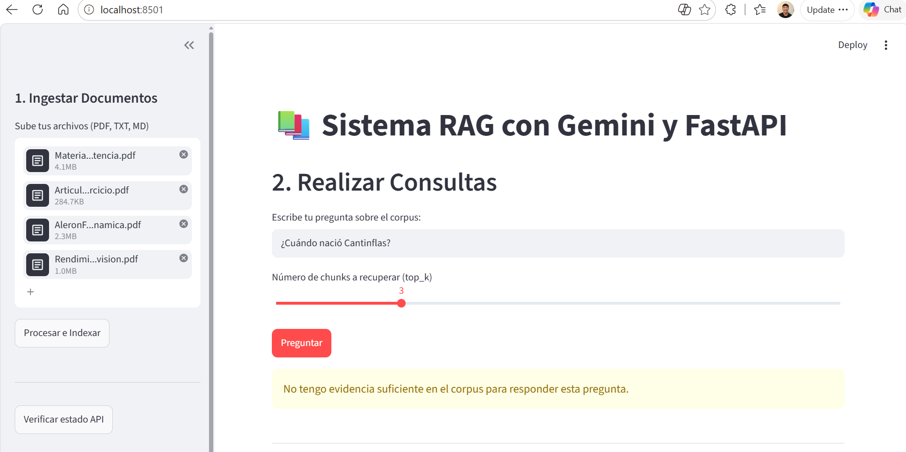

# Proyecto final — Sistema RAG (Streamlit + FastAPI + ChromaDB + Google AI)

## Objetivo

Implementar un sistema **RAG** completo, con:

| Capa | Tecnología | Rol |
|---|---|---|
| UI | **Streamlit** | Cargar documentos, preguntar y ver la respuesta con citas |
| API | **FastAPI** | Ingestar, consultar e informar el estado del índice |
| Índice | **ChromaDB** | Guardar chunks + embeddings y devolver los más similares |
| Embeddings | **Google AI** | Convertir cada chunk y cada pregunta en un vector |

La interfaz **no** habla con Chroma ni con Google AI en silencio: todo pasa
por la API. Streamlit es un cliente HTTP de FastAPI.

## Desarrollo
Previo a presentar los resultados obtenidos en la ejecución del sistema RAG, se añade una imagen de la arquitectura construida para el proyecto, de donde se genera una aplicación que utiliza un enfoque modular y desacoplado, separando la lógica del servidor API (Backend) de la interfaz de usuario (Frontend). La organización de directorios se compone de la siguiente manera:

#### Arquitectura RAG

| Arquitectura |
| :---: |
|  |

El backend expone una API RESTful que gestiona la ingesta de documentos, la vectorización y la recuperación/generación de respuestas, mientras el Frontend permite proporcionar un panel interactivo que permite arrastrar y subir los documentos directamente así como ingresar las preguntas de interés, ajustar el parámetro de chunks $top k$ y visualizar la respuesta generada por el sistema. 

#### Panel Frontend RAG

| Panel Frontend RAG |
| :---: |
|  |

### Reporte de prueba
Para la prueba del RAG utilizando el panel mostrado previamente, se cargaron 5 documentos de temas variados y diferentes, 3 de ellos son de nutrición deportiva para deportes de alta resistencia, el otro es un reporte de grado de la aerodinámica de alerones en monoplazas de F1 y el último una antología poética de Jaime Sabines. Se añaden las evidencias de las preguntas realizadas 

| Evidencia 1 RAG | Evidencia 2 RAG |
| :---: | :---: |
|  |  |
| Evidencia 3 RAG | Evidencia 4 RAG|
|  |  |

Se destaca que el programa respondió de manera exitosa las preguntas realizadas con respecto a los temas relacionados a la documentación precargada. Se adjuntan en las evidencias las consultas hechas y las respuestas ofrecidas con base en los vectores identificados con similitud. Es importante mencionar que con base en el número de $Top K$ seleccionados, el sistema era capaz de poder indexar ese mismo número de citas o parrafos que tuvieran similitud con la pregunta realizada. \
Un aspecto relevante identificado al correr las pruebas de estas preguntas es que las similitudes identificadas, a pesar de estar programadas con el mayor número de afinidad, no necesariamente logran responder con precisión la interrogante. En algunos casos la respuesta se encontraba en el top 2 de citas identificadas y no en el primero, además de que el programa aún no logra poder resumir información concreta de todo para dar una respuesta precisa, sólo una referencia. \
Entre las evidencias también se añade el caso solicitado de una pregunta fuera de dominio y se muestra el caso exitoso de respuesta. 

Este proyecto fue de gran utilidad para poder dimensionar la arquitectura que involucra poder construir un sistema de generación aumentada por recuperación, y también la diferencia que hay entre la salida de un modelo de lenguaje o los alcances reales que puede generar un chatbot. El ejemplo permite entender la necesidad de que para un modelo de lenguaje que cumpla con tareas variadas de forma exitosa es necesario un entrenamiento con volúmenes de datos amplios y usando millones de parámetros para generar resultados favorables y útiles.
